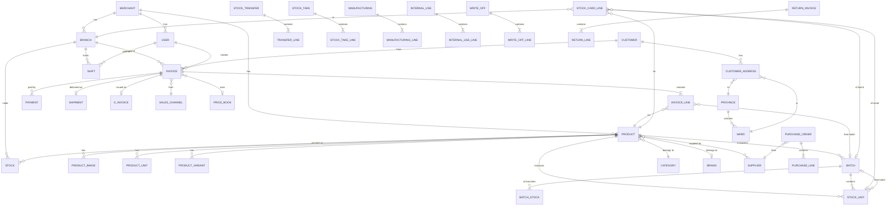

# THIẾT KẾ ĐỐI TƯỢNG & DATABASE — DỰ ÁN QUẢN LÝ BÁN HÀNG (KIOTVIET-LIKE)

**Bối cảnh:** Tổng hợp toàn bộ phân tích từ testzone17 + tài liệu chính thức KiotViet → đề xuất schema cho 1 hệ thống POS/quản lý bán hàng tương đương.

**Nguyên tắc thiết kế:**
- Multi-tenant (nhiều merchant trên 1 cluster)
- Multi-branch (1 merchant nhiều chi nhánh)
- Audit trail bất biến cho mọi nghiệp vụ kho
- Denormalize có chủ đích (`runningBalance`, `currentStock`) để query fast
- Soft delete cho master data, immutable cho transactions
- Sẵn sàng mở rộng cho Lô, Serial, Multi-channel

---

## 1. ER DIAGRAM (HIGH-LEVEL)



---

## 2. MODULE STRUCTURE — 10 MODULES, ~45 TABLES

```
┌─────────────────────────────────────────────────────────────────┐
│ A. TENANCY & ACCESS                                             │
│    - merchant, user, role, permission                           │
├─────────────────────────────────────────────────────────────────┤
│ B. ORG STRUCTURE                                                │
│    - branch, pickup_address                                     │
├─────────────────────────────────────────────────────────────────┤
│ C. PRODUCT CATALOG                                              │
│    - product, product_image, product_unit, product_variant,     │
│      category, brand, attribute, attribute_value, supplier,     │
│      product_supplier                                           │
├─────────────────────────────────────────────────────────────────┤
│ D. INVENTORY                                                    │
│    - stock, stock_norm, batch, batch_stock, stock_unit          │
├─────────────────────────────────────────────────────────────────┤
│ E. PRICING                                                      │
│    - price_book, price_book_item, tax_rate                      │
├─────────────────────────────────────────────────────────────────┤
│ F. PARTNERS                                                     │
│    - customer, customer_address                                 │
├─────────────────────────────────────────────────────────────────┤
│ G. SALES TRANSACTIONS                                           │
│    - invoice, invoice_line, payment, payment_method,            │
│      sales_channel, return_invoice, return_line,                │
│      preorder, e_invoice, e_invoice_template                    │
├─────────────────────────────────────────────────────────────────┤
│ H. INVENTORY TRANSACTIONS                                       │
│    - purchase_order, purchase_line,                             │
│      stock_transfer, transfer_line,                             │
│      stock_take, stock_take_line,                               │
│      manufacturing, manufacturing_line,                         │
│      internal_use, internal_use_line,                           │
│      write_off, write_off_line,                                 │
│      stock_card_line  ⭐ (ledger trung tâm)                     │
├─────────────────────────────────────────────────────────────────┤
│ I. DELIVERY                                                     │
│    - shipment, delivery_partner, delivery_service               │
├─────────────────────────────────────────────────────────────────┤
│ J. PROMOTION & LOYALTY                                          │
│    - promotion, voucher, coupon, loyalty_points                 │
├─────────────────────────────────────────────────────────────────┤
│ K. ADMINISTRATIVE                                               │
│    - province, ward                                             │
├─────────────────────────────────────────────────────────────────┤
│ L. OPERATIONS                                                   │
│    - shift, shift_cash_count                                    │
└─────────────────────────────────────────────────────────────────┘
```

---

## 3. CHI TIẾT TỪNG BẢNG

### A. TENANCY & ACCESS

**merchant** — Tài khoản gian hàng (root tenant)
| Cột | Kiểu | Constraints | Ghi chú |
|---|---|---|---|
| id | BIGINT | PK | |
| code | VARCHAR(50) | UNIQUE, NOT NULL | vd `testzone17` |
| name | VARCHAR(200) | NOT NULL | |
| industry | VARCHAR(50) | | F&B, retail, pharmacy... |
| settings | JSONB | | Toggles: trackByBatch, trackBySerial, taxEnabled... |
| created_at, updated_at | TIMESTAMPTZ | | |
| status | ENUM | | active / suspended / churned |

**user** — Người dùng nội bộ merchant
| Cột | Kiểu | Constraints | Ghi chú |
|---|---|---|---|
| id | BIGINT | PK | |
| merchant_id | BIGINT | FK, NOT NULL | |
| username | VARCHAR(100) | NOT NULL | |
| email, phone | VARCHAR | | |
| password_hash | VARCHAR(255) | | |
| display_name | VARCHAR(200) | | |
| role | ENUM | | OWNER / MANAGER / CASHIER / ACCOUNTANT |
| default_branch_id | BIGINT | FK → branch | |
| commission_rate | DECIMAL(5,2) | | % commission |
| status | ENUM | | active / disabled |
| created_at | TIMESTAMPTZ | | |
| UNIQUE | | (merchant_id, username) | |

**role** + **permission** — chuẩn RBAC (đề xuất generic, không bắt buộc inline trên user)

---

### B. ORG STRUCTURE

**branch** — Chi nhánh vật lý
| Cột | Kiểu | Constraints | Ghi chú |
|---|---|---|---|
| id | BIGINT | PK | |
| merchant_id | BIGINT | FK | |
| code | VARCHAR(50) | NOT NULL | vd `CN001` |
| name | VARCHAR(200) | | |
| address_line | VARCHAR(500) | | |
| ward_id | BIGINT | FK → ward | |
| province_id | BIGINT | FK → province | |
| phone | VARCHAR(20) | | |
| is_central | BOOLEAN | DEFAULT FALSE | "Chi nhánh trung tâm" |
| status | ENUM | | active / closed |
| UNIQUE | | (merchant_id, code) | |

**pickup_address** — Địa chỉ lấy hàng (cho ship)
| Cột | Kiểu | Constraints | Ghi chú |
|---|---|---|---|
| id | BIGINT | PK | |
| merchant_id | BIGINT | FK | |
| branch_id | BIGINT | FK, NULLABLE | nếu là address của chi nhánh |
| label | VARCHAR(200) | | "Kho Mỹ Đình" |
| recipient_name | VARCHAR(200) | | |
| phone | VARCHAR(20) | | |
| address_line, ward_id, province_id | | | |
| is_default | BOOLEAN | | |

---

### C. PRODUCT CATALOG

**product** ⭐ — Hàng hóa (entity trung tâm catalog)
| Cột | Kiểu | Constraints | Ghi chú |
|---|---|---|---|
| id | BIGINT | PK | |
| merchant_id | BIGINT | FK | |
| code | VARCHAR(50) | NOT NULL | SP000XXX hoặc custom |
| name | VARCHAR(500) | NOT NULL | |
| barcode | VARCHAR(100) | | |
| product_type | ENUM | NOT NULL | GOODS / SERVICE / COMBO / MANUFACTURED |
| category_id | BIGINT | FK | |
| brand_id | BIGINT | FK, NULLABLE | |
| description | TEXT | | |
| note | TEXT | | |
| weight_grams | INTEGER | | |
| location | VARCHAR(100) | | "Kệ A1" — free text |
| cost_price | DECIMAL(15,2) | | Giá vốn (nếu fixed) |
| cost_calc_method | ENUM | | FIXED / WEIGHTED_AVG |
| sale_price_before_tax | DECIMAL(15,2) | | |
| sale_price_after_tax | DECIMAL(15,2) | | |
| sale_tax_rate | DECIMAL(5,2) | | 0/5/8/10% |
| purchase_tax_rate | DECIMAL(5,2) | | |
| track_by_batch | BOOLEAN | DEFAULT FALSE | ⭐ flag bật Lô |
| track_by_serial | BOOLEAN | DEFAULT FALSE | ⭐ flag bật Serial |
| earn_loyalty_points | BOOLEAN | DEFAULT TRUE | |
| sellable_directly | BOOLEAN | DEFAULT TRUE | "Bán trực tiếp" |
| status | ENUM | | active / inactive |
| created_at | TIMESTAMPTZ | | |
| UNIQUE | | (merchant_id, code) | |

**product_image**
| Cột | Kiểu | Ghi chú |
|---|---|---|
| id | BIGINT PK | |
| product_id | BIGINT FK | |
| url | VARCHAR(500) | |
| display_order | INTEGER | |
| is_primary | BOOLEAN | |
| file_size_bytes | INTEGER | ≤ 2MB |

**product_unit** — Đơn vị tính (multi per product)
| Cột | Kiểu | Ghi chú |
|---|---|---|
| id | BIGINT PK | |
| product_id | BIGINT FK | |
| unit_name | VARCHAR(50) | "cái", "hộp", "thùng" |
| conversion_factor | DECIMAL(10,4) | quy đổi về đơn vị cơ bản |
| price_before_tax | DECIMAL(15,2) | giá riêng cho đơn vị này |
| is_base_unit | BOOLEAN | |
| sellable_directly | BOOLEAN | |

**product_variant** — Biến thể (SKU con)
| Cột | Kiểu | Ghi chú |
|---|---|---|
| id | BIGINT PK | |
| parent_product_id | BIGINT FK → product | |
| variant_code | VARCHAR(50) | SP000XXX-RED-M |
| attribute_values | JSONB | `{"size": "M", "color": "Đỏ"}` |
| price_override | DECIMAL(15,2) | nullable |
| barcode | VARCHAR(100) | |

**category** — Nhóm hàng (hierarchical)
| Cột | Kiểu | Ghi chú |
|---|---|---|
| id | BIGINT PK | |
| merchant_id | BIGINT FK | |
| parent_id | BIGINT FK self | nullable cho root |
| name | VARCHAR(200) | |
| path | VARCHAR(500) | denormalized "/Mỹ phẩm/Sữa dưỡng" |

**brand** — Thương hiệu
| Cột | Kiểu | Ghi chú |
|---|---|---|
| id | BIGINT PK | |
| merchant_id | BIGINT FK | |
| name | VARCHAR(200) | |

**attribute** + **attribute_value** — Thuộc tính (Size, Màu...)
```
attribute(id, merchant_id, name) — "SIZE", "Màu sắc"
attribute_value(id, attribute_id, value) — "S", "M", "L"
```

**supplier** — Nhà cung cấp
| Cột | Kiểu | Ghi chú |
|---|---|---|
| id | BIGINT PK | |
| merchant_id | BIGINT FK | |
| code | VARCHAR(50) | |
| name | VARCHAR(200) | |
| phone, email, address | | |
| tax_id | VARCHAR(50) | MST |
| current_debt | DECIMAL(15,2) | denormalized |

**product_supplier** — Junction (1 SP có thể có nhiều NCC, ngược lại)
```
(product_id, supplier_id, is_primary, last_purchase_price, last_purchase_date)
```

---

### D. INVENTORY ⭐

**stock** — Tồn kho aggregate (SP × CN)
| Cột | Kiểu | Constraints | Ghi chú |
|---|---|---|---|
| id | BIGINT | PK | |
| product_id | BIGINT | FK, NOT NULL | |
| branch_id | BIGINT | FK, NOT NULL | |
| quantity | DECIMAL(15,4) | NOT NULL DEFAULT 0 | denormalized — auto cập nhật mỗi giao dịch |
| reserved_qty | DECIMAL(15,4) | | KH đã đặt, chưa xuất |
| on_order_qty | DECIMAL(15,4) | | Đã đặt NCC, chưa về |
| business_status | ENUM | | SELLING / PAUSED — **per branch** |
| updated_at | TIMESTAMPTZ | | |
| UNIQUE | | (product_id, branch_id) | |
| INDEX | | (branch_id, quantity) | tìm SP sắp hết |

**stock_norm** — Định mức tồn min/max per CN
| Cột | Kiểu | Ghi chú |
|---|---|---|
| product_id, branch_id | FK | |
| min_quantity | DECIMAL(15,4) | |
| max_quantity | DECIMAL(15,4) | |
| safety_stock | DECIMAL(15,4) | (đề xuất bổ sung) |
| PK | (product_id, branch_id) | |

**batch** — Lô hàng (chỉ tồn tại khi `product.track_by_batch = true`)
| Cột | Kiểu | Constraints | Ghi chú |
|---|---|---|---|
| id | BIGINT | PK | |
| product_id | BIGINT | FK | |
| batch_code | VARCHAR(100) | NOT NULL | Số lô |
| manufacture_date | DATE | | (đề xuất bổ sung) |
| expire_date | DATE | | HSD |
| supplier_batch_code | VARCHAR(100) | | (đề xuất bổ sung) |
| created_via_doc_code | VARCHAR(50) | | PN000XXX — phiếu nhập tạo lô |
| created_at | TIMESTAMPTZ | | |
| UNIQUE | | (product_id, batch_code) | |
| INDEX | | (product_id, expire_date) | FEFO lookup |

**batch_stock** — Tồn của lô tại từng CN
| Cột | Kiểu | Ghi chú |
|---|---|---|
| batch_id | BIGINT FK | |
| branch_id | BIGINT FK | |
| quantity | DECIMAL(15,4) | |
| PK | (batch_id, branch_id) | |

**stock_unit** — Đơn vị vật lý có Serial (`product.track_by_serial = true`)
| Cột | Kiểu | Constraints | Ghi chú |
|---|---|---|---|
| id | BIGINT | PK | |
| product_id | BIGINT | FK | |
| serial_number | VARCHAR(100) | NOT NULL | IMEI hoặc serial |
| batch_id | BIGINT | FK, NULLABLE | nếu có cả Lô + Serial |
| current_branch_id | BIGINT | FK, NULLABLE | NULL khi đã bán |
| status | ENUM | | IN_STOCK / SOLD / RETURNED / LOST / DAMAGED |
| inbound_at | TIMESTAMPTZ | | |
| inbound_doc_code | VARCHAR(50) | | PN |
| outbound_at | TIMESTAMPTZ | | |
| outbound_doc_code | VARCHAR(50) | | HD |
| current_owner_customer_id | BIGINT | FK, NULLABLE | nếu đã bán |
| warranty_expire_at | DATE | | (đề xuất) |
| UNIQUE | | (product_id, serial_number) | |
| INDEX | | (current_branch_id, status) | tìm hàng còn |

---

### E. PRICING

**price_book**
```
id, merchant_id, name, is_default, effective_from, effective_to, status
```

**price_book_item**
```
price_book_id, product_id, product_unit_id (nullable),
price_before_tax, price_after_tax,
PK(price_book_id, product_id, product_unit_id)
```

**tax_rate** — chuẩn hóa thuế suất
```
id, merchant_id, code, name, rate_pct, applies_to (sale/purchase/both)
```

---

### F. PARTNERS

**customer**
| Cột | Kiểu | Ghi chú |
|---|---|---|
| id | BIGINT PK | |
| merchant_id | BIGINT FK | |
| code | VARCHAR(50) | |
| name | VARCHAR(200) | |
| phone | VARCHAR(20) | indexed |
| email | VARCHAR(200) | |
| customer_tier | ENUM | NORMAL/VIP/WHOLESALE |
| loyalty_points | INTEGER | denormalized |
| total_spent | DECIMAL(15,2) | denormalized |
| current_debt | DECIMAL(15,2) | |
| birthday | DATE | |
| INDEX | (merchant_id, phone) | |

**customer_address**
```
id, customer_id, recipient_name, phone, address_line, ward_id, province_id, is_default
```

---

### G. SALES TRANSACTIONS ⭐

**invoice** ⭐ — Hóa đơn bán hàng
| Cột | Kiểu | Constraints | Ghi chú |
|---|---|---|---|
| id | BIGINT | PK | |
| merchant_id | BIGINT | FK | |
| code | VARCHAR(20) | NOT NULL | **HD000XXX** |
| branch_id | BIGINT | FK, NOT NULL | |
| sales_channel_id | BIGINT | FK | Trực tiếp/TikTok/Shopee... |
| price_book_id | BIGINT | FK | |
| customer_id | BIGINT | FK, NULL | NULL = khách lẻ |
| customer_name_snapshot | VARCHAR(200) | | cache |
| salesperson_id | BIGINT | FK → user | |
| shift_id | BIGINT | FK, NULL | |
| status | ENUM | NOT NULL | DRAFT / COMPLETED / CANCELED |
| invoice_date | TIMESTAMPTZ | NOT NULL | |
| total_amount_before_tax | DECIMAL(15,2) | | |
| total_discount | DECIMAL(15,2) | | |
| coupon_code | VARCHAR(50) | | |
| total_vat | DECIMAL(15,2) | | |
| other_fee | DECIMAL(15,2) | | shipping fee, service... |
| total_payable | DECIMAL(15,2) | | "Khách cần trả" |
| total_paid | DECIMAL(15,2) | | |
| note | TEXT | | |
| created_at, updated_at | | | |
| UNIQUE | | (merchant_id, code) | |
| INDEX | | (branch_id, invoice_date) | |
| INDEX | | (customer_id, invoice_date) | |

**invoice_line**
| Cột | Kiểu | Ghi chú |
|---|---|---|
| id | BIGINT PK | |
| invoice_id | BIGINT FK | |
| line_no | INTEGER | |
| product_id | BIGINT FK | |
| product_unit_id | BIGINT FK | |
| product_variant_id | BIGINT FK nullable | |
| batch_id | BIGINT FK nullable | ⭐ nếu SP track Lô |
| stock_unit_id | BIGINT FK nullable | ⭐ nếu SP track Serial |
| quantity | DECIMAL(15,4) | |
| unit_price | DECIMAL(15,2) | |
| discount | DECIMAL(15,2) | |
| line_total | DECIMAL(15,2) | |
| note | VARCHAR(500) | |

**payment**
```
id, invoice_id, payment_method_id, amount, paid_at, transaction_ref, status
```

**payment_method** (master)
```
id, merchant_id, name, type (CASH/TRANSFER/CARD/EWALLET), config JSONB
```

**sales_channel**
```
id, merchant_id, name, type (POS/SHOPEE/TIKTOK/LAZADA/...), external_id, logo_url
```

**return_invoice** — Trả hàng
```
id, code (TH000XXX), original_invoice_id FK, branch_id, customer_id,
reason, total_refund, status, created_at
```
**return_line** — như invoice_line + lý do trả

**preorder** — Đặt hàng (chưa xuất kho)
```
id, code (DH000XXX), customer_id, total, status (PENDING/CONFIRMED/FULFILLED/CANCELED), expected_date
```

**e_invoice** — Hóa đơn điện tử
| Cột | Kiểu | Ghi chú |
|---|---|---|
| id | BIGINT PK | |
| invoice_id | BIGINT FK UNIQUE | |
| template_id | BIGINT FK | |
| auto_issued | BOOLEAN | |
| issued_at | TIMESTAMPTZ | |
| cqt_code | VARCHAR(100) | mã của Cơ quan Thuế |
| status | ENUM | DRAFT/ISSUED/REJECTED |
| xml_signed | TEXT | hoặc reference S3 |

**e_invoice_template**
```
id, merchant_id, code, name (MELYA, HĐ GTGT MTT xăng dầu...)
```

---

### H. INVENTORY TRANSACTIONS ⭐

Mọi phiếu kho follow pattern **Header + Lines** + sinh ra **stock_card_line**.

**purchase_order** (Nhập hàng — PN)
```
id, code (PN000XXX), supplier_id, branch_id (nhập vào CN nào),
status (DRAFT/COMPLETED/CANCELED), total_amount, vat,
amount_paid, amount_payable, purchase_date, expected_delivery_date,
import_cost JSONB (phí vận chuyển, hải quan...)
```
**purchase_line**
```
id, purchase_order_id, product_id, product_unit_id, batch_id (nullable),
quantity, unit_cost, line_total
```

**stock_transfer** (Chuyển hàng — TRF)
```
id, code (TRF000XXX), from_branch_id, to_branch_id,
status (DRAFT/IN_TRANSIT/RECEIVED), transferred_at, received_at,
total_value, total_qty_sent, total_qty_received,
match_status (MATCHED/MISMATCH), note
```
**transfer_line**
```
id, stock_transfer_id, product_id, batch_id (nullable),
qty_sent, qty_received, unit_value
```

**stock_take** (Kiểm kho — KK)
```
id, code (KK000XXX), branch_id, status, balanced_at,
total_actual_qty, total_diff_value,
total_diff_increase, total_diff_decrease
```
**stock_take_line**
```
id, stock_take_id, product_id, batch_id (nullable),
system_qty, actual_qty, diff_qty
```

**manufacturing** (Sản xuất — SX)
```
id, code (SX000XXX), branch_id, status,
output_product_id, output_quantity,
total_input_cost, total_output_value
```
**manufacturing_line** — vừa input vừa output qua flag

**internal_use** (Xuất dùng nội bộ — XN)
```
id, code (XN000XXX), branch_id, status,
use_type (UNIFORM/TOOL/SAMPLE/OTHER),
recipient_employee_id, total_value, note
```

**write_off** (Xuất hủy — XH)
```
id, code (XH000XXX), branch_id, status,
reason (DAMAGED/EXPIRED/LOST/THEFT/OTHER),
total_value, note
```

#### `stock_card_line` ⭐⭐⭐ — Ledger trung tâm (immutable)

| Cột | Kiểu | Constraints | Ghi chú |
|---|---|---|---|
| id | BIGINT | PK | |
| merchant_id | BIGINT | FK | |
| product_id | BIGINT | FK, NOT NULL | indexed |
| branch_id | BIGINT | FK, NOT NULL | indexed |
| batch_id | BIGINT | FK, NULLABLE | nếu SP track lô |
| stock_unit_id | BIGINT | FK, NULLABLE | nếu SP track serial |
| product_unit_id | BIGINT | FK | đơn vị tính của giao dịch |
| document_type | ENUM | NOT NULL | HD/PN/TRF_OUT/TRF_IN/KK/SX/XN/XH/TH/TPN |
| document_code | VARCHAR(20) | NOT NULL | mã chứng từ — denormalized cho UI |
| document_id | BIGINT | NOT NULL | FK polymorphic tới các bảng phiếu |
| transaction_type | ENUM | NOT NULL | enum 13 giá trị |
| partner_type | ENUM | | CUSTOMER/SUPPLIER/BRANCH/EMPLOYEE/NONE |
| partner_id | BIGINT | | |
| partner_name_snapshot | VARCHAR(200) | | cache name |
| transaction_price | DECIMAL(15,2) | | Giá GD |
| cost_price | DECIMAL(15,2) | | Giá vốn tại thời điểm |
| quantity | DECIMAL(15,4) | NOT NULL | **CÓ DẤU** — âm = xuất, dương = nhập |
| running_balance | DECIMAL(15,4) | NOT NULL | **denormalized** — tồn cuối |
| transaction_at | TIMESTAMPTZ | NOT NULL | thời gian phát sinh |
| created_at | TIMESTAMPTZ | NOT NULL | thời gian ghi DB |
| created_by_user_id | BIGINT | FK | |
| INDEX | | (product_id, branch_id, transaction_at DESC) | thẻ kho query |
| INDEX | | (document_code) | tra cứu phiếu |
| INDEX | | (batch_id) WHERE batch_id IS NOT NULL | |

**Constraint quan trọng:** Bảng này **append-only** (immutable). Không UPDATE, không DELETE. Sai → tạo bút toán điều chỉnh ngược.

---

### I. DELIVERY

**shipment**
| Cột | Kiểu | Ghi chú |
|---|---|---|
| id | BIGINT PK | |
| invoice_id | BIGINT FK UNIQUE | |
| pickup_address_id | BIGINT FK | địa chỉ lấy hàng |
| delivery_address JSONB | | snapshot recipient + ward + province |
| delivery_partner_id | BIGINT FK | |
| service_id | BIGINT FK | "Giao thường"... |
| tracking_code | VARCHAR(100) | mã vận đơn |
| fee | DECIMAL(15,2) | |
| weight_gram | INTEGER | |
| length_cm, width_cm, height_cm | INTEGER | |
| package_count | INTEGER | DEFAULT 1 |
| cod_amount | DECIMAL(15,2) | thu hộ |
| shipper_note | VARCHAR(500) | |
| status | ENUM | WAITING/PICKED_UP/IN_TRANSIT/DELIVERED/RETURNED/FAILED |
| expected_delivery_at | TIMESTAMPTZ | |
| delivered_at | TIMESTAMPTZ | |

**delivery_partner** (Viettel Post, GHN, GHTK, J&T, Tự giao hàng)
```
id, merchant_id, name, type (KIOTVIET_GATEWAY/SELF/EXTERNAL),
api_config JSONB, status
```

**delivery_service**
```
id, delivery_partner_id, name (Giao thường, Hỏa tốc, COD...), base_fee
```

---

### J. PROMOTION & LOYALTY

**promotion**
```
id, merchant_id, name, type (PERCENT/FIXED/BUY_X_GET_Y),
applies_to (INVOICE/LINE/CATEGORY),
discount_value, conditions JSONB,
valid_from, valid_to, status
```

**voucher** — Voucher đã phát hành (instance của promotion)
```
id, promotion_id, code (unique), recipient_customer_id, redeemed_at, redeemed_invoice_id
```

**coupon** — Mã coupon nhập tay (1 mã có thể dùng nhiều lần)
```
id, code, promotion_id, max_uses, current_uses, valid_until
```

**loyalty_points** — Sổ điểm
```
id, customer_id, points_delta, related_invoice_id, balance_after, created_at
```

---

### K. ADMINISTRATIVE (chuẩn hành chính VN sau sáp nhập 2025)

**province** — Tỉnh / Thành phố
```
id, code, name, type (PROVINCE/CITY), is_central_city
```

**ward** — Phường / Xã (sau sáp nhập 2025 còn 2 cấp)
```
id, province_id FK, code, name, type (WARD/COMMUNE), legacy_district VARCHAR
```

(Không còn `district` table — đã bỏ sau cải cách 2025)

---

### L. OPERATIONS

**shift** — Ca làm việc (cashier session)
| Cột | Kiểu | Ghi chú |
|---|---|---|
| id | BIGINT PK | |
| merchant_id, branch_id | FK | |
| user_id | FK | nhân viên |
| opened_at, closed_at | TIMESTAMPTZ | |
| opening_cash | DECIMAL(15,2) | |
| closing_cash_actual | DECIMAL(15,2) | đếm thực tế |
| closing_cash_system | DECIMAL(15,2) | hệ thống tính |
| diff | DECIMAL(15,2) | |
| status | ENUM | OPEN/CLOSED |

---

## 4. KEY DESIGN DECISIONS

### 4.1 Multi-tenancy

Mọi bảng đều có cột `merchant_id` (trừ master hành chính `province`, `ward`). Strategy: **Shared DB, shared schema, row-level isolation**.
- Pros: Cost effective, dễ join cross-data
- Cons: Cần row-level security (Postgres RLS) hoặc app-level filter rất kỷ luật

### 4.2 Stock = denormalized aggregate

`stock.quantity` là **denormalized** từ stock_card_line. Đường truyền:
- Mỗi phiếu kho được commit → trigger insert vào `stock_card_line` → UPDATE `stock.quantity += delta`
- Recovery: nếu nghi sai, có thể `SUM(stock_card_line.quantity)` để rebuild

### 4.3 Running balance trên stock_card_line

`running_balance` của 1 dòng = tồn ngay sau giao dịch đó. Computed at write time:
```sql
running_balance = (SELECT COALESCE(running_balance, 0) 
                   FROM stock_card_line 
                   WHERE product_id = ? AND branch_id = ?
                     [+ batch_id condition if any]
                   ORDER BY transaction_at DESC, id DESC LIMIT 1)
                   + delta
```

**Edge case backdate:** Nếu chèn dòng backdate, toàn bộ dòng sau đó phải recompute. → KiotViet có thể restrict không cho backdate, hoặc có background job.

### 4.4 Polymorphic document reference

`stock_card_line.document_id + document_type` tham chiếu đa hình tới các bảng phiếu khác nhau (invoice/purchase_order/stock_transfer/...). Trade-off:
- Pros: 1 bảng ledger trung tâm
- Cons: Mất FK integrity ở DB level → enforce ở app layer + có denormalized `document_code` để query nhanh

Alternative: `stock_card_line` không có FK trực tiếp tới phiếu nguồn, chỉ store document_code → tra cứu qua bảng tương ứng dựa trên prefix.

### 4.5 Lô + Serial là 2 trục độc lập

`product.track_by_batch` và `product.track_by_serial` là **2 boolean flags độc lập**:
- Cả 2 = FALSE → SP thường, không track gì
- track_by_batch = TRUE, track_by_serial = FALSE → SP track Lô (thực phẩm)
- track_by_batch = FALSE, track_by_serial = TRUE → SP track Serial (điện thoại)
- Cả 2 = TRUE → SP track cả 2 (hiếm — vd thuốc đắt tiền có cả lô và serial)

Khi cả 2 bật, `stock_card_line` mang cả `batch_id` và `stock_unit_id`.

### 4.6 Mã chứng từ — sequential per type, per merchant

Tăng độc lập theo `(merchant_id, document_type)`. Implement:
- Bảng `sequence_counter(merchant_id, doc_type, next_value)` với row-level lock khi tăng
- Hoặc dùng Postgres sequence riêng cho mỗi merchant × type (nhiều sequence)
- Hoặc UUID + tách `display_code` riêng (giảm contention)

Format: `[PREFIX][6-digit zero-padded]` → vẫn UNIQUE chỉ trong scope merchant, có thể clash giữa merchants (cùng `HD000001`).

### 4.7 Immutable transaction tables

Các bảng `invoice`, `purchase_order`, `stock_card_line`, `payment`, `shipment`, `e_invoice` → **append-only sau khi COMPLETED**. Nếu cần sửa: hủy + tạo phiếu mới.

Status `DRAFT` cho phép sửa; sau COMPLETED → khóa.

### 4.8 Soft delete cho master data

`customer`, `product`, `category`... có cột `status` (active/disabled/deleted) thay vì xóa physical. Lý do: transactions cũ vẫn cần ref tới record cũ.

### 4.9 Snapshot fields để chống dữ liệu drift

Master data có thể đổi (vd KH đổi tên, SP đổi giá). Bảng giao dịch giữ snapshot tại thời điểm GD:
- `invoice.customer_name_snapshot`
- `invoice_line.unit_price` (không reference price_book_item.price hiện tại)
- `stock_card_line.partner_name_snapshot`

---

## 5. INDEXES QUAN TRỌNG

```sql
-- Stock card query: load thẻ kho cho 1 SP × CN sort DESC
CREATE INDEX idx_stockcard_product_branch_time 
  ON stock_card_line(product_id, branch_id, transaction_at DESC);

-- Lookup phiếu theo mã chứng từ
CREATE INDEX idx_stockcard_doc_code ON stock_card_line(document_code);

-- Tồn lô theo HSD (cho FEFO)
CREATE INDEX idx_batch_product_expiry ON batch(product_id, expire_date)
  WHERE expire_date IS NOT NULL;

-- Serial lookup
CREATE UNIQUE INDEX idx_stockunit_serial 
  ON stock_unit(product_id, serial_number);

-- Find available serial at branch
CREATE INDEX idx_stockunit_branch_status 
  ON stock_unit(current_branch_id, status) 
  WHERE status = 'IN_STOCK';

-- Hóa đơn theo CN × ngày (báo cáo)
CREATE INDEX idx_invoice_branch_date 
  ON invoice(branch_id, invoice_date DESC);

-- Hóa đơn theo khách hàng
CREATE INDEX idx_invoice_customer_date 
  ON invoice(customer_id, invoice_date DESC) 
  WHERE customer_id IS NOT NULL;

-- KH theo phone (search nhanh)
CREATE INDEX idx_customer_merchant_phone ON customer(merchant_id, phone);

-- Stock query (low stock alert)
CREATE INDEX idx_stock_branch_qty ON stock(branch_id, quantity);
```

---

## 6. SCALING CONSIDERATIONS

### 6.1 Hot tables
- `stock_card_line` — tăng nhanh nhất (mỗi line item × mỗi tác động → 1 dòng). Với shop 5000 đơn/ngày × 5 SP/đơn → 25k dòng/ngày × 365 = 9M dòng/năm cho 1 merchant
- → Strategy: **Partition by month** trên `transaction_at`, archive >2 năm sang cold storage

### 6.2 Read replicas
- Báo cáo + Phân tích đi qua read replica
- POS bán hàng đi qua master để đảm bảo consistency

### 6.3 Caching layer
- `product` + `price_book_item` → Redis cache, TTL 5p
- `stock.quantity` → Redis cache ngắn (30s) cho UI list, invalidate trên write

### 6.4 Event streaming
- Mọi commit phiếu publish event lên Kafka/Redis Stream
- Consumers: cập nhật stock, cập nhật customer LTV, tính loyalty, push notification, đẩy lên marketplace, gửi HĐĐT

---

## 7. MIGRATION & SEEDING

### 7.1 Master data cần seed lúc setup merchant
```
- province (63 → ~30 sau sáp nhập 2025)
- ward (10,000+)
- tax_rate (VAT 0/5/8/10%)
- payment_method (Tiền mặt, Chuyển khoản, Thẻ, Ví)
- e_invoice_template (mẫu chuẩn TCT)
- price_book "Bảng giá chung" (default)
- sales_channel "Trực tiếp" (default)
- delivery_partner (Viettel Post, GHN, GHTK, J&T sẵn config)
```

### 7.2 Schema migration strategy
- Backward compatible — không drop column trực tiếp
- Toggle `track_by_batch` / `track_by_serial` cho merchant cũ → mặc định FALSE, opt-in từng SP

---

## 8. TỔNG KẾT — 45 BẢNG

| Module | Bảng |
|---|---|
| Tenancy | merchant, user, role, permission |
| Org | branch, pickup_address |
| Catalog | product, product_image, product_unit, product_variant, category, brand, attribute, attribute_value, supplier, product_supplier |
| Inventory | stock, stock_norm, batch, batch_stock, stock_unit |
| Pricing | price_book, price_book_item, tax_rate |
| Partners | customer, customer_address |
| Sales | invoice, invoice_line, payment, payment_method, sales_channel, return_invoice, return_line, preorder, e_invoice, e_invoice_template |
| Inv Trans | purchase_order, purchase_line, stock_transfer, transfer_line, stock_take, stock_take_line, manufacturing, manufacturing_line, internal_use, internal_use_line, write_off, write_off_line, **stock_card_line** ⭐ |
| Delivery | shipment, delivery_partner, delivery_service |
| Promotion | promotion, voucher, coupon, loyalty_points |
| Admin | province, ward |
| Operations | shift |

**Tổng: 45 bảng** — đủ cho 1 hệ thống POS đa chi nhánh, đa kênh, hỗ trợ Lô + Serial.

---

## 9. PHẦN MỞ RỘNG (ĐÃ ĐỀ XUẤT TRONG BRAINSTORM)

Nếu phát triển thêm các module trong file brainstorm trước, sẽ cần thêm các bảng:

| Module brainstorm | Bảng mới |
|---|---|
| Workforce (C1) | attendance, payslip, shift_schedule |
| Loyalty App (D1) | mobile_app_user, push_token, app_session |
| Marketing automation (D2) | campaign, campaign_step, campaign_target, message_log |
| CDP (D3) | customer_segment, customer_segment_member, customer_tag |
| KiotViet Pay (E1) | wallet, wallet_transaction, reconciliation_batch |
| Tín dụng (E2) | credit_line, credit_drawdown, credit_repayment |
| Wholesale (F1) | wholesale_price_book, b2b_credit_limit |
| Serial AI Recall (mới đề xuất) | recall_event, recall_target |
| Auto Markdown | markdown_rule, markdown_application |
| Smart Forecast | demand_forecast, replenishment_suggestion |

Mỗi module mới có thể được xây dựng **incrementally** trên schema core 45 bảng — không cần redesign nền.
